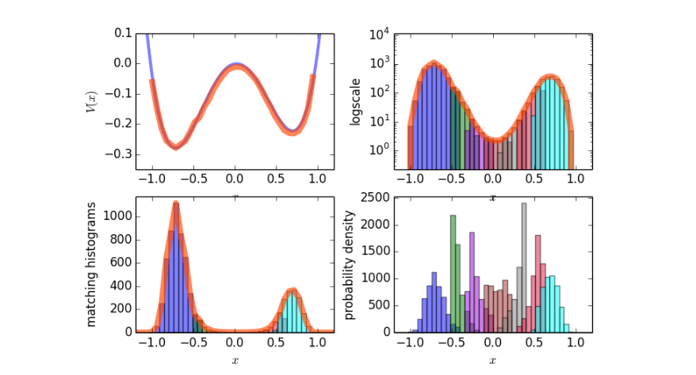

.. _examples-mc:

Monte Carlo examples
====================

This is a collection of examples showing how the pyretis
library can be used to run Monte Carlo examples.

.. _examples-mc-umbrella-sampling:

Umbrella Sampling
-----------------

This example will simply calculate the free energy profile in a given,
known, potential using umbrella sampling. The results we will obtain are
shown in the figure below: the potential energy :math:`V(x)`
and the probability density.

   Sample results for the potential energy and the probability density.

We begin by importing the pyretis library:

.. code-block:: python

    from pyretis.core import System, RandomGenerator
    from pyretis.core.simulation.mc_simulation import UmbrellaWindowSimulation
    from pyretis.forcefield import ForceField
    from pyretis.forcefield.potentials import DoubleWell, RectangularWell
    from pyretis.analysis import histogram, match_all_histograms

And we import `numpy <http://www.numpy.org/>`_
and `matplotlib <http://matplotlib.org/>`_
which we will use for some additional numerical methods and for plotting.

.. code-block:: python

    import numpy as np
    from matplotlib import pyplot as plt

First, we set up the system by defining the units we will
use and adding a particle (labeled as 'X') at a specified position.

.. code-block:: python

    mysystem = System(temperature=500, units='eV/K')
    mysystem.add_particle(name='X', pos=np.array([-0.7]))

Next we define the force field in terms of potential functions.
Here, we create the unbiased potential - a double well potential -
and a biased version of the potential where a rectangular well is used.
Finally, the biased potential is attached to the system.

.. code-block:: python

    potential_dw = DoubleWell(a=1, b=1, c=0.02)
    potential_rw = RectangularWell()
    forcefield = ForceField(desc='Double well', potential=[potential_dw])
    forcefield_bias = ForceField(desc='Double well with rectangular bias',
                                 potential=[potential_dw, potential_rw])
    mysystem.forcefield = forcefield_bias

In order to run the actual simulation, we need to specify some additional
settings, like where the umbrella windows should be placed and how many
cycles we need to perform:

.. code-block:: python

    umbrellas = [[-1.0, -0.4], [-0.5, -0.2], [-0.3, 0.0],
                 [-0.1, 0.2], [0.1, 0.4], [0.3, 0.6], [0.5, 1.0]]
    n_umb = len(umbrellas)
    MINCYCLES = 1e4  # number of MC steps to perform
    MAXDX = 0.1  # maximum allowed displacement in the MC step(s).

and we create a random number generator for use in the umbrella simulation:

.. code-block:: python

    RANDSEED = 1  # seed for random number generator:
    RGEN = RandomGenerator(seed=RANDSEED)

We are now ready to run the simulation. We will do this by looping over
the umbrella windows we defined,

.. code-block:: python

    trajectory, energy = [], []  # to store all trajectories & energies
    for i, umbrella in enumerate(umbrellas):
        print('Running umbrealla no: {} of {}. Location: {}'.format(i + 1, n_umb,
                                                                    umbrella))
        # Move rectangular potential to correct place:
        params = {'left': umbrella[0], 'right': umbrella[1]}
        mysystem.forcefield.update_potential_parameters(potential_rw, params)
        mysystem.potential()  # recalculate potential energy
        over = umbrellas[min(i + 1, n_umb - 1)][0]  # position we must cross
        simulation = UmbrellaWindowSimulation(mysystem, umbrella, over,
                                              RGEN, MAXDX,
                                              mincycle=MINCYCLES)
        # Also create empy list for storing some data:
        traj, ener = [], []
        for result in simulation.run():
            for pos in mysystem.particles.pos:
                traj.append(pos)
                ener.append(mysystem.v_pot)
        trajectory.append(np.array(traj))
        energy.append(np.array(ener))
        print('Done. Cycles: {}'.format(simulation.cycle['stepno']))

The simulation is now done, and we can do the analysis and plot the results.
For the analysis we match the histograms:

.. code-block:: python

    # We can now post-process the simulation output.
    BINS = 100
    LIM = (-1.1, 1.1)
    histograms = [histogram(traj, bins=BINS, limits=LIM) for traj in trajectory]
    # extract the bins (the midpoints) and the bin-width:
    bin_x = histograms[0][-1]
    dbin = bin_x[1] - bin_x[0]
    # We are going to match these histograms:
    print('Matching histograms...')
    histograms_s, _, hist_avg = match_all_histograms(histograms, umbrellas)

And we finally plot the results:

.. code-block:: python

    print('Plotting matched histograms')
    fig = plt.figure()
    axs = fig.add_subplot(111)
    axs.set_yscale('log')
    axs.set_xlabel('Position ($x$)', fontsize='large')
    axs.set_ylabel('Matched histograms', fontsize='large')
    colors = ['blue', 'green', 'darkviolet', 'brown', 'gray', 'crimson', 'cyan']
    for i, histo in enumerate(histograms_s):
        axs.bar(bin_x - 0.5 * dbin, histo, dbin, color=colors[i],
                alpha=0.6, log=True)
    axs.plot(bin_x, hist_avg, lw=7, color='orangered', alpha=0.6,
             label='Average after matching')
    axs.legend()
    plt.xlim((-1.1, 1.1))

    print('Plotting the free energy')
    fig2 = plt.figure()
    ax2 = fig2.add_subplot(111)
    XPOT = np.linspace(-2, 2, 1000)
    free = -np.log(hist_avg) / mysystem.temperature['beta']  # free energy
    # set up unbiased potential
    VPOT = np.array([forcefield.evaluate_potential(pos=xi) for xi in XPOT])
    free += (VPOT.min() - free.min())
    ax2.plot(XPOT, VPOT, 'blue', lw=3, label='Unbiased potential', alpha=0.5)
    ax2.plot(bin_x, free, lw=7, alpha=0.5, color='green', label='Free energy')
    ax2.set_xlabel('Position ($x$)', fontsize='large')
    ax2.set_ylabel('Potential energy ($V(x)$) / eV', fontsize='large')
    ax2.legend()
    plt.xlim((-1.1, 1.1))
    plt.ylim((-0.3, 0.05))
    plt.show()

