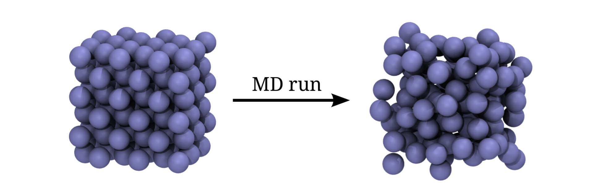

.. _examples-md:

Molecular dynamics examples
===========================

This section contains examples on how molecular dynamics simulations
can be performed with pyretis.

.. _examples-md-nve:

Lennard Jones NVE
-----------------

This example will simulate a Lennard Jones fluid under NVE conditions.
We start from a regular lattice and simulate the melting at a temperature
of 0.8 in reduced units as illustrated in the figure below.
Our goal is to obtain the pressure of the
fluid at the given temperature and density.

    Initial and final structure of the Lennard-Jones simulation.
    The initial structure (left) is a FCC lattice, while the final
    structure is less ordered.

We begin by importing the pyretis library:

.. code-block:: python

    from pyretis.core import Box, System
    from pyretis.core.simulation import create_simulation

And we import `numpy <http://www.numpy.org/>`_
and `matplotlib <http://matplotlib.org/>`_
which we will use for some additional numerical methods and for plotting.

.. code-block:: python

    import numpy as np
    from matplotlib import pyplot as plt

.. _examples-md-gromacs:

Molecular dynamics with Gromacs
-------------------------------

This is an example on how to use the excellent program gromacs with
pyretis.
