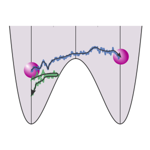
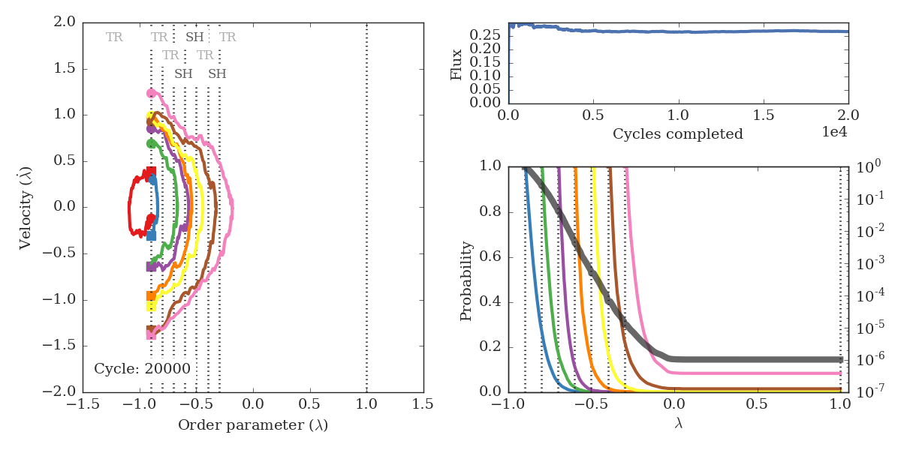
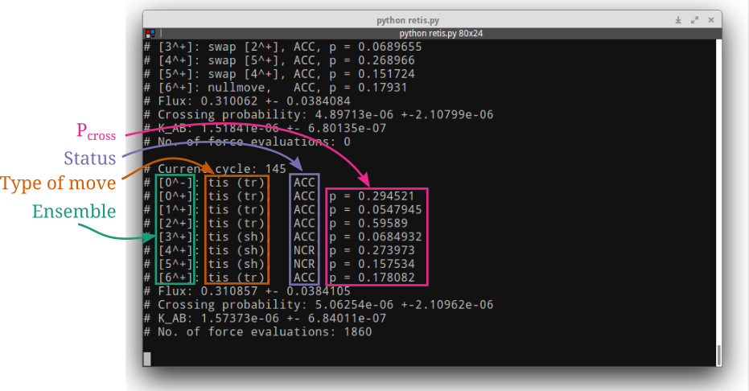

.. _examples-molmod-2016:

Molecular modeling: Introduction to RETIS
=========================================

Introduction
------------

In this exercise you will explore a rare event
with the Replica Exchange Transition Interface
Sampling (RETIS) algorithm. 

We will consider a simple 1D potential where a particle is moving.
The potential is given by
:math:`V_{\text{pot}} = x^4 - 2 \times x^2` where :math:`x` is the position. 
By plotting this potential, we see that we have two states
(at :math:`x=-1` and :math:`x=1`) separated by a barrier (at :math:`x=0`):

    The potential energy as a function of the position. We have two
    stable states separated by a barrier.

Using the RETIS algorithm, we will compute the rate constant for
the transition between the two states. We will also try to position
the RETIS interfaces to maximize the efficiency of our calculation.
The exercise is structured as follows:

* `Installing pyretis and running the exercise`_.
  Short version:

  - Install pyretis (``pip install pyretis``)
  - Install matplotlib (``pip install matplotlib``)
  - Download `retis.py <http://pyretis.org/examples/retis.py>`_
  - Download `retis_movie.py <http://pyretis.org/examples/retis_movie.py>`_

* `Part 1 - Introduction`_

* `Part 2 - Improving the efficiency`_

* `References`_

**How to pass:**

* From `Part 2 - Improving the efficiency`_, show the teaching
  assistant the results from your **best** simulation. Here, "best"
  is the simulation with fewest force evaluations and lowest uncertainties
  for a fixed number of steps as specified in the exercise.
  The results to show the teaching
  assistant are the interfaces you have used, the number of force evaluations,
  the initial flux, the crossing probability and rate constant with
  error estimates.

Installing pyretis and running the exercise
-------------------------------------------

In this example we will make use of the pyretis library for carrying
out the RETIS simulations and we will use 
`matplotlib <http://matplotlib.org/>`_ for
plotting some results. These two libraries will have
to be installed before we start:

1. The pyretis library is distributed in the Python Package Index and
   can be installed using pip:[1]_

   .. code-block:: bash
 
       pip install pyretis

   If you want to install the library system wide, you will need
   super-user access (typically a `sudo` will do). If you don't have
   super-user access, pip works well
   with `virtualenv <https://pypi.python.org/pypi/virtualenv>`_ and we refer
   to the virtualenv user guide for more information about setting this up. [2]_
   
   Note: If you have a previous installation of the library, it can
   be upgraded using

   .. code-block:: bash

       pip install --upgrade pyretis

2. Matplotlib can also be installed using pip. However, for the best
   performance we recommend that you follow a guide specific for your
   operative system. Please see the matplotlib documentation. [3]_ 
   If you are sure that all matplotlib requirements are satisfied,
   you can install it directly using pip:

   .. code-block:: bash

      pip install matplotlib

We will use two python scripts in this example to run the RETIS simulation.
One will display an animation on the fly, while the
other script will just output some text results.

Download the example
script `retis_movie.py <http://pyretis.org/examples/retis_movie.py>`_ to
a location on your computer. This script can be executed by running

.. code-block:: bash

   python retis_move.py

which should display an animation similar to the image shown below.

    Snapshot from the RETIS animation. The left panel shows accepted
    trajectories for the different ensembles and the upper text shows
    the kind of move performed: TR = Time Reversal, SH = Shooting,
    NU = Null (no move) and SW = Swapping. The upper right panel displays
    the calculated initial flux, while the lower right panel shows the
    probabilities for the different ensembles (values on the left y-axis)
    and the overall matched probability (in gray, values on the right
    y-axis). Vertical dotted lines display the positions of the
    RETIS interfaces.

The bulk of this script handles the plotting, and we will **not** go
into details on how matplotlib is used to plot the result. We will rather
focus on the RETIS algorithm and how we can use it to calculate
rate constants. But before we do that, let us also try the text-based script. 
Download the example
script `retis.py <http://pyretis.org/examples/retis.py>`_ to
a location on your computer and execute it by running

.. code-block:: bash

   python retis.py > output.txt 

which should print out some text similar to the image shown below:

    Sample output from the text based RETIS script. After each completed
    RETIS cycle the script outputs the cycle number, and then some results
    for each ensemble. The ensemble names are given in the first
    column (green color), the type of move executed is shown in the next
    column (orange color), the status after the move (blue color) and the
    current estimate of the crossing probability for each ensemble
    (purple color). Then the current estimates for the flux, the crossing
    probability and the rate constant is outputted. Finally
    the number of force evaluations are given.

As show in figures above, we make use of some abbreviations to describe the type
of moves we are making and the outcome of these moves. These abbreviations
are described in the table below.

.. table:: Abbreviations for the RETIS moves

    +----------------+-------------------------------+
    |  Abbreviation  | Description                   |
    +================+===============================+
    | ``swap``       | A RETIS swapping move.        |
    +----------------+-------------------------------+
    | ``nullmove``   | Just accepting the last       |
    |                | accepted path once again.     |
    +----------------+-------------------------------+
    |   ``tis (sh)`` | A TIS shooting move           |
    +----------------+-------------------------------+
    |  ``tis (tr)``  | A TIS time-reversal move      |
    +----------------+-------------------------------+

.. table:: Abbreviations for the RETIS statuses

    +----------------+--------------------------------------------+
    |  Abbreviation  | Description                                |
    +================+============================================+
    | ``ACC``        | The path has been accepted                 |
    +----------------+--------------------------------------------+
    | ``BWI``        | When integrating backward in time for a    |
    |                | shooting move we arrived at the right      |
    |                | interface and not the left one, i.e. we    |
    |                | reached the *Wrong Interface*              |
    +----------------+--------------------------------------------+
    | ``BTL``        | When integrating backward in time for a    |
    |                | shooting move, the backward trajectory     |
    |                | will have a maximum length determined      |
    |                | by the RETIS algorithm.                    | 
    |                | ``BTL`` means that we did                  |  
    |                | reach any interfaces before we exceeded    |
    |                | the maximum path length.                   |
    +----------------+--------------------------------------------+
    | ``BTX``        | We also have a maximum length for          |
    |                | trajectories in order to limit the memory  |
    |                | the trajectories use. ``BTX`` means that   |
    |                | the trajectory length exceeded this limit  |
    |                | before we reached a interface.             |
    +----------------+--------------------------------------------+
    | ``FTL``        | Similar to ``BTL`` in the **Forward**      |
    |                | direction.                                 |
    +----------------+--------------------------------------------+
    | ``FTX``        | Similar to ``BTX`` in the **Forward**      |
    |                | diretion.                                  |
    +----------------+--------------------------------------------+
    | ``NCR``        | No crossing with middle interface. This    |
    |                | can happen when we attempt swapping move   |
    +----------------+--------------------------------------------+

Now, hopefully you are able to execute the two example scripts we will
be using. If you let them run, they will complete 20000 cycles
and you can then compare your results with the previously
reported data of of van Erp. [4]_ [5]_
If you would like to run fewer cycles, this can be achieved
just by changing the specified number of steps in
the dictionary ``SETTINGS`` defined in the python script:

* In order to change from 20000 steps to just 150,
  just change the ``steps`` keyword, from:

  .. code-block:: python

     SETTINGS['simulation'] = {'task': 'retis',
                               'steps': 20000,
                               'interfaces': INTERFACES}

  to:

  .. code-block:: python
   
     SETTINGS['simulation'] = {'task': 'retis',
                               'steps': 150,
                               'interfaces': INTERFACES}

In fact the RETIS simulation you are running is defined
with this python dictionary. In this exercise we will just
change a few of these settings:

* The number of interfaces which are defined in a list:
  
  .. code-block:: python

     INTERFACES = [-0.9, -0.8, -0.7, -0.6, -0.5, -0.4, -0.3, 1.0]

  We can for instance see what happens if we just use fewer interfaces:

  .. code-block:: python
   
     INTERFACES = [-0.9, -0.8, -0.6, -0.4, -0.3, 1.0]

* And the RETIS specific settings:

  The settings for the RETIS method is split into two parts,
  one is RETIS specific and the other is TIS specific. The former
  controls swapping while the latter the shooting. In this exercise
  we will just change the frequencies of the different moves.
  The percentage of swapping are controlled by the ``swapfreq`` keyword
  of the RETIS settings:

  .. code-block:: python

     # RETIS specific settings:
     SETTINGS['retis'] = {'swapfreq': 0.5,
                          'nullmoves': True,
                          'swapsimul': True}

  Here, 50 % (a fraction of 0.5) will be swapping moves.
  What about the remaining 50% of the moves? These will be TIS moves
  and here we have two options - shooting or time reversal. The relative
  frequency of these moves is determined by the ``freq`` keyword in
  the TIS specific settings which specifies the frequency of TIS moves
  which should be time reversal moves.

  .. code-block:: python

    # TIS specific settings:
    SETTINGS['tis'] = {'freq': 0.5,
                       'maxlength': 20000,
                       'aimless': True,
                       'allowmaxlength': False,
                       'sigma_v': -1,
                       'seed': 0,
                       'zero_momentum': False,
                       'rescale_energy': False,
                       'initial_path': 'kick'}

  Here, 50% will be shooting moves and 50% will be time-reversal moves.
  Note that this is in percentage of the TIS moves, so in total we will have
  50% swapping, 25% shooting and 25% time reversal.

  What happens with a ``swapfreq`` equal to 0.8 and a ``freq``
  equal to 0.6? We will have 80% swapping moves, 12% (:math:`0.2\times0.6`)
  time reversal moves and 8% (:math:`0.2 \times (1-0.6)`) shooting moves. 

Part 1 - Introduction
---------------------

We will warm up with a 
few questions about the RETIS method and we will run a few short
simulations to see how the method works in practice.

1. What "problem" are we solving with the RETIS method?
   Why don't we just run a brute-force simulation?

2. How would you (in just a few sentences) describe what happens
   when you run a RETIS simulation. Some keywords to get you started:
   swapping, shooting, time-reversal, path ensembles, rate, crossing
   probability... Here you can also try to explain what is displayed
   in the animation shown by running ``retis_movie.py``.

3. In the RETIS method we have three main moves which generate new
   paths. These are the shooting, time-reversal and swapping moves.
   How do these moves generate new paths?
   Which move is the most computationally demanding?
   Which one is the least computationally demanding?

4. Let us check your answers to the previous question by performing two
   short retis simulations with the ``retis.py`` script using
   different swapping frequencies. One of the outputs from
   the ``retis.py`` script is the number of force evaluations which
   is a measure of the computational cost. Compare the total number
   of force evaluations in these two cases:

   a. Set ``steps`` to 100 and ``swapfreq`` to 0.2 and
      run a RETIS simulation using:

      .. code-block:: bash

         python retis.py > swap-0.2.txt

   b. Set ``steps`` to 100 and ``swapfreq`` to 0.8 and
      run a RETIS simulation using:

      .. code-block:: bash
         
         python retis.py > swap-0.8.txt

   Note: Here it pays of knowing some very simple unix commands. For
   instance you can extract the number of force evaluations by doing

   .. code-block:: bash

      grep evaluate swap-0.8.txt | cut -d ':' -f 2 | tr -dc '0-9\n' > force-0.8.txt

   In which of these two cases are the number of force evaluations greatest?
   Does this agree with your answer to question 3? What happes if you 
   increase the ``freq`` keyword? Is this as expected?

5. Why do we use so many path ensembles in our RETIS simulation?
   Explore what happens when you change the number of interfaces
   in the ``retis_movie.py`` script. For instance, reduce the
   number of interfaces to just two:

   .. code-block:: python

      INTERFACES = [-0.9, 1.0]

   and set the number of steps to 200 and run the simulation. Compare to
   what you see when you use a larger number of interfaces:

   .. code-block:: python
     
      INTERFACES = [-0.9, -0.8, -0.7, -0.6, -0.5, -0.4, -0.3, 1.0]

   for the same number of steps. 
   In these two simulations you can also set

   .. code-block:: python

      PCROSS_LOG = True

   to show the crossing probabilities on a log scale.

6. The swapping move is the defining move for the RETIS algorithm and
   is essentially the move that separate it from the TIS algorithm.
   What is the purpose of the swapping move? What will happen if we
   remove it? Investigate this using the ``retis_movie.py``
   script and setting the frequency of swapping moves to 0. Here,
   you can run 200 steps and compare with the output from the
   previous question. (Use the same 8 interfaces and set
   ``PCROSS_LOG = TRUE``).

Part 2 - Improving the efficiency
---------------------------------

In the last part in the previous section, you ran several very short
RETIS simulation. Here we will run some longer simulations and
we will see how efficiently we can run the RETIS simulations. 
For instance, if we set the interfaces to

.. code-block:: python
     
    INTERFACES = [-0.9, -0.8, -0.7, -0.6, -0.5, -0.4, -0.3, 1.0]

``steps`` to 2000 and the frequencies to 0.5, the output will be similar to:

.. code-block:: bash

   # Flux: 0.293853 +- 0.00723067
   # Crossing probability: 1.37741e-06 +-4.64538e-06
   # K_AB: 4.04757e-07 +- 1.36509e-06

with a total number of force evaluations equal to: 1900606. As you can
see there are rather lager uncertainties as 2000 is in fact a small
number of steps. In this part of the exercise, we will see if we
can improve the situation and our goal is to lower (if possible)
the number of force evaluations and the uncertainty. Here, you
can proceed as you like, but to get you started here are
some suggestions:

* Run first some short simulations (say 100-200 steps) where you test out
  different positions of interfaces and also different number
  of interfaces. Here you should make use of both the ``retis_movie.py``
  and ``retis.py`` scripts to investigate your changes influences
  the results.

* After having found a set of interfaces you are happy with, run a
  longer simulation (2000 steps) with the ``retis.py`` script
  and report your results to the teaching assistant. How does your
  results compare to the results
  given above. Are you able to perform better?

References
----------

.. [1] The pip user documentation, https://pip.pypa.io/en/stable
.. [2] The virtualenv user guide, https://virtualenv.pypa.io/en/stable/userguide/

.. [3] The matplotlib installation instructions, http://matplotlib.org/users/installing.html

.. [4] Titus S. Van Erp, Dynamical Rare Event Simulation Techniques for Equilibrium and Nonequilibrium Systems,
       Advances in Chemical Physics, 151, pp. 27 - 60, 2012, http://dx.doi.org/10.1002/9781118309513.ch2

.. [5] https://arxiv.org/abs/1101.0927
