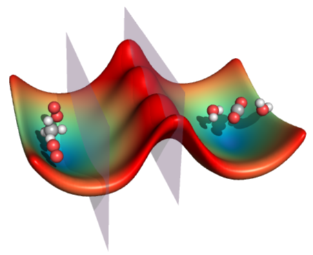
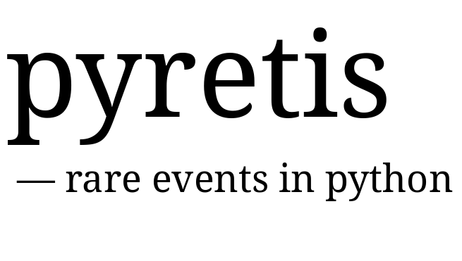

.. pyretis documentation master file, created by
   sphinx-quickstart on Fri Jun 19 11:01:24 2015.
   You can adapt this file completely to your liking, but it should at least
   contain the root `toctree` directive.

*******************
Welcome to pyretis!
*******************

pyretis is a molecular simulation library for **rare events** with
emphasis on `transition interface
sampling <http://en.wikipedia.org/wiki/Transition_path_sampling#Transition_interface_sampling>`_
and `replica exchange transition interface
sampling <http://www.van-erp.org>`_.

pyretis is :ref:`open source <pyretis-license>`, written in
`python <https://www.python.org>`_ and simulations can either
be executed using a high-level python script using
the :ref:`pyretis library <api-doc>`,

.. code-block:: python

  from pyretis.core import create_system, create_simulation
  settings = {'task': 'md-nve',
              # more settings...
             }
  system = create_system(settings)
  simulation = create_simulation(settings, system)
  for results in simulation.run():
      print(results)  # print out calculated properties

or by using a simple text-based :ref:`input script <user-guide-input>`.

The usage of pyretis is described in the :ref:`user guide <user-guide-index>`
where you can learn how to use pyretis. 

Installation
============

pyretis is currently in closed beta. When pyretis is
released, the current version can be installed by pip:

.. code-block:: bash

    pip install pyretis

The development version can be cloned
from `gitlab <https://gitlab.com/andersle/>`_,

.. code-block:: bash

    git clone git@gitlab.com:YYY/XXX

and sourced in your python path:

.. code-block:: bash

    export PYTHONPATH=$PYTHONPATH:/some/dir/pyretis

In order to run pyretis, the following python libraries are needed:

* `SciPy <http://www.scipy.org/>`_, `NumPy <http://www.numpy.org/>`_,
  and `matplotlib <http://matplotlib.org/>`_
  (see also the information on
  `installing the SciPy Stack <http://www.scipy.org/install.html>`_).

* `Jinja2 <http://jinja.pocoo.org/docs/dev/>`_

* `Docutils <http://docutils.sourceforge.net/>`_

* `Sphinx <http://sphinx-doc.org/>`_ (for building the documentation).

These packages can be installed by:

.. code-block:: bash

    pip install -r requirements.txt

using the `requirements.txt` file in the source code directory.

Contents
========

.. toctree::
    :maxdepth: 2

    about/index.rst
    user/index.rst
    api/pyretis.rst
    examples/index.rst
    developer/index.rst

Indices and tables
------------------

* :ref:`genindex`
* :ref:`modindex`
* :ref:`search`
