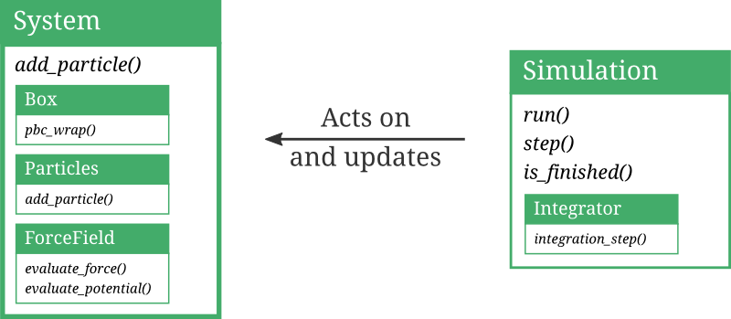

.. _user-guide-intro-api:

Introduction to the pyretis library
===================================

In this introduction to the pyretis library
(which we sometimes will refer to as the *API* --
application programming interface),
the main classes and functions from the pyretis library
will be discussed. A complete
description to the library is not given here, but can be
found in the :ref:`pyretis API documentation <api-doc>`.

The pyretis library contains methods and classes that handle
the different aspects of a simulation. These are grouped
into sub-modules:

* :ref:`pyretis.core <user-guide-intro-api-core>` for setting up and running
  simulations

* :ref:`pyretis.forcefield <user-guide-intro-api-core>` for defining
  force fields to use in simulations

* :ref:`pyretis.analysis <user-guide-intro-api-analysis>` for analysing the
  output from simulations

* :ref:`pyretis.inout <user-guide-intro-api-inout>` for handling the input
  and output to pyretis

* :ref:`pyretis.tools <user-guide-intro-api-tools>` for performing some simple
  tasks useful for setting up simulations.

In the following sections, we will discuss these modules.
Since the `pyretis.core` and `pyretis.forcefield` modules
naturally interact, they are described together.

.. _user-guide-intro-api-core:

The core and force field libraries
----------------------------------

The two main pyretis classes we will discuss here are the

* `System` which defines the system  we are investigating. It will
  typically contain particles, a simulation box and a
  force field. The base class for the `System` is defined in
  :ref:`pyretis.core.system <api-core-system>`.

* `Simulation` which defines a simulation we can run. A simulation
  will typically act on a `System` and alter its state.
  The base class for the `Simulation` is defined in
  :ref:`pyretis.core.simulation.simulation <api-core-simulation-simulation>`.

In addition, we will consider the classes for
:ref:`boxes <user-guide-intro-api-box>`,
:ref:`particles <user-guide-intro-api-particles>`,
and
:ref:`force fields <user-guide-intro-api-forcefield>`.
An illustration of the relation between
these base classes are given
in :numref:`figure %s <figure-relation-base-objects>`.

.. _figure-relation-base-objects:

    Illustration of the relations between base objects.
    Examples of class methods are written in *italic* (arguments not shown).
    The different classes may also contain
    references to other classes (illustrated here by the smaller boxes
    contained within the larger ones). Here, the system class contains
    references to instances of the `Box`, `Particles` and `ForceField`
    classes while the `Simulation` class contains a reference to an
    instance of the `Integrator` class.
    The typical interaction between the `Simulation` and the `System`
    is also shown. One example of this is using the
    `Integrator` in the `Simulation` in order to update the positions
    and velocities of the `Particles` in the `System`.

In the following we will show some simple examples on how these different
classes can be used.
We will not discuss the
`Integrator` class shown
in :numref:`figure %s <figure-relation-base-objects>` and we
refer the interested user to the documentation
for the :ref:`pyretis.core.integrators <api-core-integrators>` module.

.. _user-guide-intro-api-box:

`Box`
~~~~~

The `Box` class simply defines a simulation box. It is useful in
simulations where we wish to have periodic boundaries. Typically,
we do not interact much with the box beyond creating it.
Boxes are created by passing a (optional) `size` which is a list
of integers either of type `[[low, high], [low, high], [low, high]]`
or type `[length, length, length]`. At the same time periodicity can
be specified with the keyword `periodic` which is a list of booleans
that determine if a dimension is periodic or not.  Default is periodic
in all directions.

Some examples:

.. code-block:: python

    from pyretis.core import Box
    box1 = Box()
    print(box1)
    size = [10, 10, 10]
    box2 = Box(size)
    print(box2)
    size = [[-10, 10], [5, 10], 10]
    box3 = Box(size, periodic=[True, True, False])
    print(box3)

.. _user-guide-intro-api-particles:

`Particles`
~~~~~~~~~~~

The `Particles` class represents a collection of particles and in many
ways it can be viewed as a particle list. Again, this is a class we
don't have to interact much with, typically we just have to populate the
particle list with particles. Internally in pyretis, the particle
list is one of the most important classes. The positions, velocities and
forces are accessed through an instance of the `Particles` class using
the class attributes `pos`, `vel` and `force`. One of the more useful
methods of the `Particles` class for us now is the `add_particle` which
we use add particles to the list.
When we initiate an instance of `Particles`, we define the dimensionality
using the `dim` keyword parameter.

.. code-block:: python

    from pyretis.core import Particles

    part = Particles(dim=3)

    pos = [0.0, 1.0, 0.0]
    vel = [0.0, 0.0, 0.0]
    force = [0.0, 0.0, 0.0]
    part.add_particle(pos, vel, force, mass=1.0, name='Ar', ptype='A')
    print(part.pos)
    pos = [1.0, 0.0, 0.0]
    part.add_particle(pos, vel, force, mass=1.0, name='Ar', ptype='A')
    print(part.pos)

Here, we can add names to particles using the keyword `name` and we
can also specify a particle type using `ptype`.
The `name` can be used to identify ('tag')
specific particles.
The particle type can
be used to specify parameters for pair interactions which is computed
by the force field.

.. _user-guide-intro-api-forcefield:

`ForceField`
~~~~~~~~~~~~

The `ForceField` class is used to define force fields.
A force field is just a list of functions (as possibly parameters)
which can be used to obtain the force and potential energy.
In general, the force field expect that its constituent potential functions
actually supports calling **three** functions which means that the
potential functions must be slightly more complex than just simple
functions — they need to be classes. If we, for the sake of an example,
let an instance of the `ForceField` class have a constituent potential
function named `func`, then the `ForceField` assumes that it can invoke:

1. `func.potential()` to obtain the potential energy.

2. `func.force()` to obtain the forces and the virial.

3. `func.potential_and_force()` to obtain the potential energy,
   forces and the virial. Typically this can be done by just calling
   `func.potential()` and `func.force()`.

Let's see an example of how we can set-up a potential function (or class)
and add it to a force field. To make things simple here, we just implement
the functions in the potential class as static methods.

.. code-block:: python

    from pyretis.forcefield import ForceField

    eq_pos = 0.0
    k_force = 1.0
    class harmonic1D(object):
        params = None
        @staticmethod
        def potential(pos):
            return 0.5 * k_force * (pos - eq_pos)**2
        @staticmethod
        def force(pos):
            return -k_force * (pos - eq_pos), None
        @staticmethod
        def potential_and_force(pos):
            pot = 0.5 * k_force * (pos - eq_pos)**2
            force = k_force * (pos - eq_pos)
            return pot, force, None

    forcefield = ForceField(desc='1D Harmonic potential',
                            potential=[harmonic1D])
    forcefield.evaluate_potential(pos=0)  # this should return 0.0

In practice, it will be simpler to create the potential functions
as new classes inheriting from the potential class which you can
read about in the documentation of the
:ref:`pyretis.forcefield.potential <api-forcefield-potential>` module and
some examples can be found in the
:ref:`pyretis.forcefield.potentials <api-forcefield-potentials>` package where
such derived classes are defined.
The `params = None` is just needed since the `ForceField` class makes
certain assumptions on what attributes the potential should have (it
assumes that the potentials we wish to use behaves like an
instance of the `Potential` class).

Enough details, let us make a quick plot
with `matplotlib <http://matplotlib.org/>`_ to see if things work as expected:

.. code-block:: python

    from matplotlib import pyplot as plt
    import numpy as np
    pos = np.linspace(-2, 2, 100)
    pot = forcefield.evaluate_potential(pos=pos)
    plt.plot(pos, pot, lw=2.5, color='0.2')
    plt.show()

.. _user-guide-intro-api-system:

`System`
~~~~~~~~

A `System` class defines the system we are investigating. It will
typically contain particles, a simulation box and a
force field. The base class for the `System` is defined in
:ref:`pyretis.core.system <api-core-system>`.

Example of creation:

.. code-block:: python

    from pyretis.core import System
    new_system = System(temperature=0.8, units='lj')

This will create an empty system with a set temperature equal to `0.8` in
`lj` units, where `lj` refers to Lennard-Jones units. It is also possible
to specify a box here in case that it needed.

.. _user-guide-intro-api-simulation:

`Simulation`
~~~~~~~~~~~~
A `Simulation` class defines a simulation we can run. A simulation
will typically act on a `System` and alter its state.
The base class for the `Simulation` is defined in
:ref:`pyretis.core.simulation.simulation <api-core-simulation-simulation>`.

Example of creation:

.. code-block:: python

    from pyretis.core.simulation import Simulation
    new_simulation = Simulation(startcycle=0, endcycle=100)

    for step in new_simulation.run():
        print(step['cycle']['stepno'])

The code block above will create a generic simulation object and run it.
This simulation is not doing anything useful, it is only incrementing the
current simulation step number from the given `startcycle` to the
given `endcycle`. In order to something more productive, we can attach
tasks to the simulation. To be concrete let us create a simulation where
we perform some annealing to find the minimum of a simple function.

.. _user-guide-intro-api-analysis:

The analysis library
--------------------

.. _user-guide-intro-api-inout:

The input & output library
--------------------------

.. _user-guide-intro-api-tools:

The tools library
-----------------
The tools library can be used to generate initial structures for a
simulation. In the tools library the function ``generate_lattice`` is
defined and it supports the creation of the following lattices where
the short hand keywords (``sc``, ``sq`` etc.) are used to select a
specific lattice:

- ``sc``: A simple cubic lattice .

- ``sq``: Square lattice (2D) with one atom in the unit cell.

- ``sq2``: Square lattice with two atoms in the unit cell.

- ``bcc``: Body-centered cubic lattice.

- ``fcc``: Face-centered cubic lattice.

- ``hcp``: Hexagonal close-packed lattice.

- ``diamond``: Diamond structure.

A lattice is generated in the following way:

.. code-block:: python

    from pyretis.tools import generate_lattice
    xyz, size = generate_lattice('diamond', [1, 1, 1], lcon=3.57)

Where the first parameter selects the lattice type, the second parameter
selects give the number of repetitions in each direction and the optional
parameter ``lcon`` is the lattice constant. The returned values are
``xyz`` -- the coordinates -- and ``size`` which is the box-size of the
generated structure. This variable can be used to define a simulation box.
It is also possible to specify a number density:

.. code-block:: python

    from pyretis.tools import generate_lattice
    xyz, size = generate_lattice('diamond', [1, 1, 1], density=1)

If the density is specified, the lattice constant ``lcon`` is deduced:

.. math::

    \text{lcon} = \left(\frac{n}{\rho}\right)^{\frac{1}{d}},

where :math:`n` is the number of particles in the unit cell,
:math:`\rho` the specified number density and :math:`d` the dimensionality.
If we wish to save a genrated lattice, this can be done as follows

.. code-block:: python

    from pyretis.tools import generate_lattice
    from pyretis.inout.fileinout.traj import write_xyz_file

    xyz, size = generate_lattice('diamond', [3, 3, 3], lcon=3.57)
    write_xyz_file('diamond.xyz', xyz, names=['C']*len(xyz), header='Diamond')

    xyz, size = generate_lattice('hcp', [3, 3, 3], lcon=2.5)
    name = ['A', 'B'] * (len(xyz) // 2)
    write_xyz_file('hcp.xyz', xyz, names=name, header='HCP test')

    xyz, size = generate_lattice('sq2', [3, 3], lcon=1.0)
    write_xyz_file('sq2.xyz', xyz, header='sq2 test')
